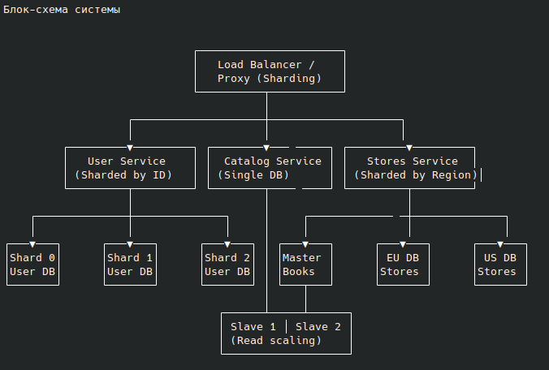

# Домашнее задание к занятию "`Шардинг`" - `Болтунов Алексей`

### Инструкция по выполнению домашнего задания

   1. Сделайте `fork` данного репозитория к себе в Github и переименуйте его по названию или номеру занятия, например, https://github.com/имя-вашего-репозитория/git-hw или  https://github.com/имя-вашего-репозитория/7-1-ansible-hw).
   2. Выполните клонирование данного репозитория к себе на ПК с помощью команды `git clone`.
   3. Выполните домашнее задание и заполните у себя локально этот файл README.md:
      - впишите вверху название занятия и вашу фамилию и имя
      - в каждом задании добавьте решение в требуемом виде (текст/код/скриншоты/ссылка)
      - для корректного добавления скриншотов воспользуйтесь [инструкцией "Как вставить скриншот в шаблон с решением](https://github.com/netology-code/sys-pattern-homework/blob/main/screen-instruction.md)
      - при оформлении используйте возможности языка разметки md (коротко об этом можно посмотреть в [инструкции  по MarkDown](https://github.com/netology-code/sys-pattern-homework/blob/main/md-instruction.md))
   4. После завершения работы над домашним заданием сделайте коммит (`git commit -m "comment"`) и отправьте его на Github (`git push origin`);
   5. Для проверки домашнего задания преподавателем в личном кабинете прикрепите и отправьте ссылку на решение в виде md-файла в вашем Github.
   6. Любые вопросы по выполнению заданий спрашивайте в чате учебной группы и/или в разделе “Вопросы по заданию” в личном кабинете.
   
Желаем успехов в выполнении домашнего задания!
   
### Дополнительные материалы, которые могут быть полезны для выполнения задания

1. [Руководство по оформлению Markdown файлов](https://gist.github.com/Jekins/2bf2d0638163f1294637#Code)

---

### Задание 1

`Приведите ответ в свободной форме........`

Активный Master + один пассивный Slave 
Основные преимущества: 
1. Повышение отказоустойчивости 
    Если master выйдет из строя, slave можно вручную (или автоматически через скрипты/оркестраторы) повысить до нового master’а.
    Это обеспечивает резервную копию "на горячую" — данные не теряются (при корректной настройке репликации).
     
2. Резервное копирование без нагрузки на основной сервер 
    Бэкапы можно снимать со slave’а — это не нагружает master, не замедляет операции записи и не блокирует таблицы.
     
3. Тестирование и отладка 
    На slave можно безопасно тестировать обновления схемы, индексы, запросы — без риска повредить production-данные.    

4. Простота настройки и управления 
    Архитектура с одним slave проще в администрировании, мониторинге и отладке — подходит для небольших и средних проектов.
    
Master + несколько Slave-серверов 
Основные преимущества: 
1. Горизонтальное масштабирование чтения 
    Можно распределить нагрузку чтения между несколькими slave-серверами.
    Например: 90% запросов — SELECT → направляем их на 3-5 slave’ов → master остаётся свободен для записи → общая производительность системы растёт.
     
2. Географическое распределение 
    Slave’ы можно разместить в разных дата-центрах или регионах:
        Пользователи в Европе читают из европейского slave.
        Пользователи в Азии — из азиатского.
        Это снижает latency и улучшает UX.        
    
3. Повышенная отказоустойчивость 
    Если один slave упадёт — остальные продолжат работать.
    Можно настроить автоматическое переключение на другой slave при аварии.
    
4. Специализированные slave’ы 
    Один slave — для отчётов и аналитики (тяжёлые запросы).
    Второй — для API и пользовательских запросов (лёгкие SELECT).
    Третий — только для бэкапов.
    Это позволяет оптимизировать ресурсы под задачи.
    
5. Нагрузочное тестирование и аналитика 
    Один из slave’ов можно использовать для запуска ресурсоёмких аналитических запросов, не влияя на основную систему.
     

---

### Задание 2

Вертикальный шардинг 

Разделим систему на три функциональные зоны, каждая со своей БД и сервером: 

<table border="1" cellpadding="8" cellspacing="0" style="border-collapse: collapse; font-family: Arial, sans-serif;">
  <thead>
    <tr style="background-color: #f2f2f2;">
      <th style="text-align: left; padding: 8px;">Сервер</th>
      <th style="text-align: left; padding: 8px;">База данных</th>
      <th style="text-align: left; padding: 8px;">Таблицы</th>
      <th style="text-align: left; padding: 8px;">Назначение</th>
      <th style="text-align: left; padding: 8px;">Режим работы</th>
    </tr>
  </thead>
  <tbody>
    <tr>
      <td style="padding: 8px;">Auth/User Server</td>
      <td style="padding: 8px;">user_db</td>
      <td style="padding: 8px;">пользователи</td>
      <td style="padding: 8px;">Авторизация, профили, персонализация</td>
      <td style="padding: 8px;">Master + Read Replicas (если нужно масштабировать чтение)</td>
    </tr>
    <tr>
      <td style="padding: 8px;">Catalog Server</td>
      <td style="padding: 8px;">catalog_db</td>
      <td style="padding: 8px;">книги</td>
      <td style="padding: 8px;">Каталог товаров, поиск, фильтрация</td>
      <td style="padding: 8px;">Master + несколько Slaves (чтение сильно нагружено)</td>
    </tr>
    <tr>
      <td style="padding: 8px;">Stores Server</td>
      <td style="padding: 8px;">stores_db</td>
      <td style="padding: 8px;">магазины</td>
      <td style="padding: 8px;">Информация о точках продаж, локации</td>
      <td style="padding: 8px;">Master (можно с 1 Slave для отказоустойчивости)</td>
    </tr>
  </tbody>
</table> 

    Каждый сервер обслуживает свою бизнес-логику → проще масштабировать, обновлять, мониторить.
    Снижается конкуренция за ресурсы: запросы на книги не влияют на авторизацию.
    Проще настраивать репликацию и бэкапы под конкретную нагрузку.
     

 
Часть 2: Горизонтальный шардинг (разделение строк) 

     

 
🔹 Пример 1: Горизонтальный шардинг для пользователи 

Ключ шардинга: user_id или region 

Хеширование по user_id % N или по региону. 

<table border="1" cellpadding="8" cellspacing="0" style="border-collapse: collapse; font-family: Arial, sans-serif; margin-top: 20px;">
  <thead>
    <tr style="background-color: #f2f2f2;">
      <th style="text-align: left; padding: 8px;">Шард</th>
      <th style="text-align: left; padding: 8px;">Диапазон user_id (mod 4)</th>
      <th style="text-align: left; padding: 8px;">Сервер</th>
      <th style="text-align: left; padding: 8px;">База данных</th>
    </tr>
  </thead>
  <tbody>
    <tr>
      <td style="padding: 8px;">Shard 0</td>
      <td style="padding: 8px;">user_id % 4 == 0</td>
      <td style="padding: 8px;">user-shard-0</td>
      <td style="padding: 8px;">user_db_shard_0</td>
    </tr>
    <tr>
      <td style="padding: 8px;">Shard 1</td>
      <td style="padding: 8px;">user_id % 4 == 1</td>
      <td style="padding: 8px;">user-shard-1</td>
      <td style="padding: 8px;">user_db_shard_1</td>
    </tr>
    <tr>
      <td style="padding: 8px;">Shard 2</td>
      <td style="padding: 8px;">user_id % 4 == 2</td>
      <td style="padding: 8px;">user-shard-2</td>
      <td style="padding: 8px;">user_db_shard_2</td>
    </tr>
    <tr>
      <td style="padding: 8px;">Shard 3</td>
      <td style="padding: 8px;">user_id % 4 == 3</td>
      <td style="padding: 8px;">user-shard-3</td>
      <td style="padding: 8px;">user_db_shard_3</td>
    </tr>
  </tbody>
</table>
	
   

Горизонтальный шардинг для магазины 

Ключ шардинга: region (географический) 
<table border="1" cellpadding="8" cellspacing="0" style="border-collapse: collapse; font-family: Arial, sans-serif; margin-top: 20px;">
  <thead>
    <tr style="background-color: #f2f2f2;">
      <th style="text-align: left; padding: 8px;">Регион</th>
      <th style="text-align: left; padding: 8px;">Сервер</th>
      <th style="text-align: left; padding: 8px;">База данных</th>
    </tr>
  </thead>
  <tbody>
    <tr>
      <td style="padding: 8px;">Европа</td>
      <td style="padding: 8px;">stores-eu</td>
      <td style="padding: 8px;">stores_db_eu</td>
    </tr>
    <tr>
      <td style="padding: 8px;">Азия</td>
      <td style="padding: 8px;">stores-asia</td>
      <td style="padding: 8px;">stores_db_asia</td>
    </tr>
    <tr>
      <td style="padding: 8px;">Сев. Америка</td>
      <td style="padding: 8px;">stores-us</td>
      <td style="padding: 8px;">stores_db_us</td>
    </tr>
    <tr>
      <td style="padding: 8px;">Лат. Америка</td>
      <td style="padding: 8px;">stores-latam</td>
      <td style="padding: 8px;">stores_db_latam</td>
    </tr>
  </tbody>
</table>
Пользователи из Европы видят магазины из stores_db_eu — низкая задержка, локализация. 

Если позже добавится таблица заказы, её можно шардировать по user_id, чтобы она лежала на том же шарде, что и пользователь — это обеспечит локальность данных и избежит cross-shard JOIN’ов. 
 
Режимы работы серверов 
<table border="1" cellpadding="8" cellspacing="0" style="border-collapse: collapse; font-family: Arial, sans-serif; margin-top: 20px;">
  <thead>
    <tr style="background-color: #f2f2f2;">
      <th style="text-align: left; padding: 8px;">Сервер</th>
      <th style="text-align: left; padding: 8px;">Режим работы</th>
      <th style="text-align: left; padding: 8px;">Комментарий</th>
    </tr>
  </thead>
  <tbody>
    <tr>
      <td style="padding: 8px;">user-shard-0..3</td>
      <td style="padding: 8px;">Master (запись + чтение)</td>
      <td style="padding: 8px;">Можно добавить read-replicas, если нагрузка на чтение высокая</td>
    </tr>
    <tr>
      <td style="padding: 8px;">catalog_db сервер</td>
      <td style="padding: 8px;">Master + несколько Slaves</td>
      <td style="padding: 8px;">Каталог книг — в основном чтение → масштабируем чтение через реплики</td>
    </tr>
    <tr>
      <td style="padding: 8px;">stores_db серверы</td>
      <td style="padding: 8px;">Master (или Master + 1 Slave)</td>
      <td style="padding: 8px;">Обновления редкие → достаточно одного Slave для отказоустойчивости</td>
    </tr>
  </tbody>
</table> 
 
 
Блок-схема системы 
 

 
   

Принципы построения и разграничения 

    Функциональная декомпозиция (вертикальный шардинг) — разделяем по бизнес-доменам: пользователи, каталог, магазины.
    Горизонтальное масштабирование по ключу — шардируем большие таблицы (пользователи, магазины) по ID или региону.
    Локальность данных — связанные данные (например, пользователь и его заказы) должны быть на одном шарде.
    Избегание cross-shard JOIN’ов — проектируем так, чтобы большинство запросов выполнялись в пределах одного шарда.
    Использование прокси/роутера — для прозрачного определения, к какому шарду идти на основе ключа (например, user_id).
     
---

